# Paye tes dettes

## Sommaire

- [Équipe](#équipe)
- [Description fonctionnelle du projet](#description-fonctionnelle-du-projet)
- [Description technique du projet](#description-technique-du-projet)
- [Stack technique](#stack-technique)
- [Fonctionnalités implémentées](#fonctionnalités-implémentées)
- [Tâches techniques réalisées](#tâches-techniques-réalisées)
- [Trello](#trello)
- [Améliorations possibles](#améliorations-possibles)
- [Instructions de compilation](#instructions-de-compilation)
- [Problèmes rencontrés](#problèmes-rencontrés)
- [Conclusion](#conclusion)
- [Captures d'écrans](#captures-décrans)

## Équipe

- Matthieu MILLEVERT (matthieu.millevert.etu@univ-lille.fr - millevert.matthieu@gmail.com)
- Alexandre LABRE (alexandre.labre.etu@univ-lille.fr)

## Description fonctionnelle du projet

- Paye tes dettes est une web application permettant de suivre les dépenses d'un groupe de personnes et de facilement pouvoir équilibrer les dépenses entre tous.
- Notre application ne nécessite aucun téléchargement, de plus, elle est compatible avec tout les navigateurs!

## Description technique du projet

- Le projet est fondé sur le principe du pattern MVC.
- Chaque couche est soigneusement découpée :
  - Le modèle est totalement indépendant du reste de l'application, grâce aux repositories et aux services.
  - La vue est assurée par des Java Server Page (JSP)
  - Les controllers sont le seul point d'entrée possible de notre web application, ils font le lien entre nos vues et notre modèle.

- Pour ce qui est de la structure du projet, on s'est imposé une architecture assez stricte.
  Les controllers peuvent seulement appeler les services, et les services peuvent appeler les repositories.

- En ce qui concerne les contrôles de saisies, nous avons particulièrement contrôlé que le mot de passe à l'inscription soit sécurisé.
  Pour ça, nous avons imposé une série de critères à respecter pour que le mot de passe choisi soit valide, comme par exemple 8 caractères minimum, une lettre minuscule, une lettre majuscule, etc...
  ***Note importante :*** le contrôle sur les critères à respecter est fait à la fois côté client avec du javascript mais également côté serveur dans les méthodes de service.

## Stack technique

- Java 17
- Spring 3
- Base de donnée embarquée H2
- Gestionnaire de dépendances Maven

## Fonctionnalités implémentées

- Inscription d'un nouvel utilisateur
- Connexion via l'email et le mot de passe
- Envoi d'un email de bienvenue, permettant d'activer son compte
- Mot de passe perdu : email avec un lien redirigeant vers une page permettant de choisir un nouveau mot de passe
- CRUD d'un évènement
- Ajout/suppression de personnes au sein d'un évènement
- Différents rôles au sein d'un évènement :
  - Propriétaire : Il est propriétaire de l'évènement, il ne peux pas être viré ni rétrogradé de l'évènement
  - Administrateur : Il peut ajouter ou supprimer des personnes d'un évènement, ou éditer cet évènement
  - Membre : Il peut ajouter des transactions dont il est à l'origine
- Transactions au sein d'un évènement
- Commentaires au sein d'un évènement
- Suggestions de résolution des dettes avec un algorithme de calcul
- Profil personnel : possibilité de changer son mot de passe, sa photo et autres informations basiques
- Profil public : tout le monde peut consulter le profil d'un utilisateur et voir ses informations de base
- Upload d'images : images de profil et image d'évènement
- Interface responsive (PC, mobile, tablette)
- Recherche d'évènements par rapport à son titre

## Tâches techniques réalisées
- Documentation de toutes les méthodes de nos services
- Rédaction de ce README
- Contrôle des saisies : contrôle du mot de passe (back et front)
- Logs de toutes les méthodes appelées dans les controllers, services et repositories avec Spring AOP
- CI/CD Gitlab

## Trello

- Voici notre trello, que nous avons utilisés tout le long du projet :
https://trello.com/invite/b/SJnc6yUq/ATTI3427f70ad7f1d24c12fcbe35050b0f51315CAACA/payetesdettes   

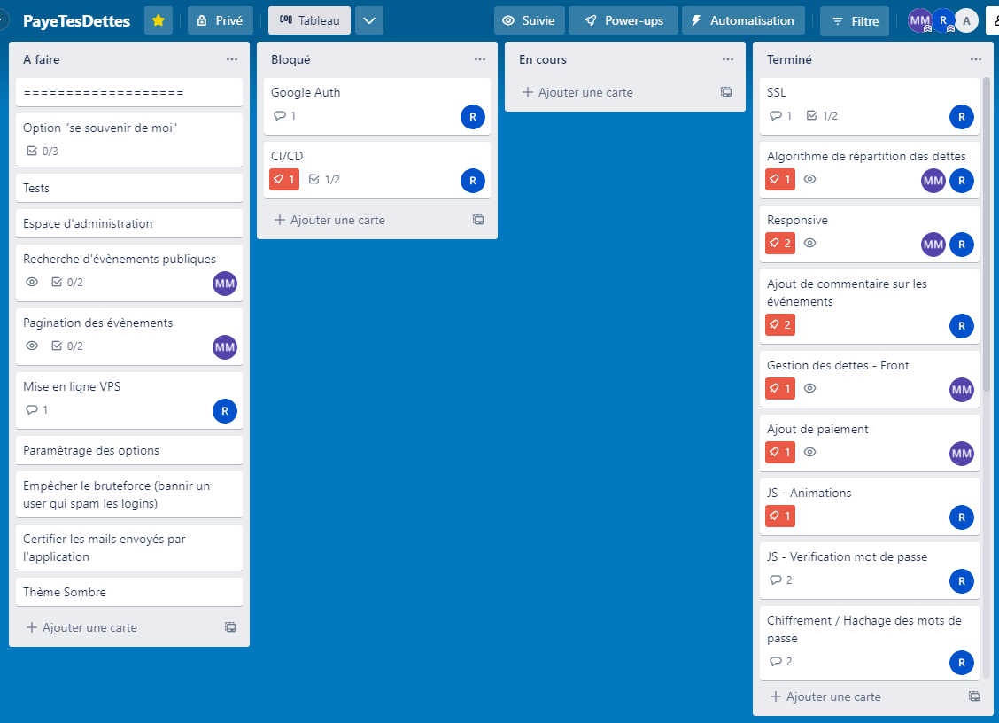    

## Améliorations possibles

Voici une liste des améliorations auxquelles nous avions pensé, mais que nous n'avons pas eu le temps d'intégrer à notre projet :

- Option "se souvenir de moi"
- Fonction de recherche des évènements
- Pagination des évènements
- Mise en production du projet sur un VPS
- Empêcher le bruteforce de mot de passe (avec par exemple une limite d'essai)
- Certifications des emails envoyés par l'application
- Thème sombre

## Instructions de compilation

Au préalable, vous devez avoir installé GIT ainsi que Maven. 
Vous devez également avoir une version de 17 de Java.

- Ouvrez un terminal et effectuez les commandes suivantes :  
`git clone https://gitlab.univ-lille.fr/alexandre.labre.etu/paye-tes-dettes.git`   
`cd payetesdettes`  
`mvn spring-boot:run`

- Si aucun message d'erreur ne s'affiche, l'application est lancée, vous pouvez y accéder via : https://localhost:8443

## Problèmes rencontrés

- Modélisation de la base de données : les liens maillés ont été difficiles à gérer, notamment pour les transactions qui sont stockés dans une Map en ManyToMany.
- Spring Security : Nous avons pas mal cherché pour implémenter Spring Security en évitant le plus possible le code déprécié, mais malheureusement, on a trouvé peu de documentation sur la nouvelle façon de configurer Spring Security.
- CI/CD : Nous avons configuré un gitlab runner sur un serveur linux vierge, avec les conseils de M.Hauspie. Nous avons donc dû gérer les règles du pare-feu et les soucis de permissions. Nous n'avons malheureusement pas réussi à intégrer du déploiement continu à 100% en raison de divers problèmes avec les certificats SSH. Lors du déploiement, le runner package et lance le projet. Le pipeline ne passe que si tout se déroule sans encombre.

## Conclusion

En conclusion, nous sommes très satisfait du résultat final du projet.   
Dès le départ, nous nous sommes énormément investi dans les trois premières semaines de façon à prendre
de l'avance, ce qui fait que nous avions déjà une base fonctionnelle au bout de 2 semaines. 
Désormais, nous sommes arrivé à un résultat qui, nous le pensons, pourrait être mis en production et utilisé réellement,
bien que diverses améliorations pourraient être réalisées pour le rendre encore plus agréable à l'utilisation.  

Durant la réalisation de ce projet, nous nous sommes contraint à travailler de façon "propre" en créant des branches par grosses features,
avec ensuite des merges requests pour que l'autre binôme puisse relire le code et apporter son expertise pour l'améliorer. 

Nous avons aussi voulu mettre l'accent sur l'expérience utilisateur et le design, en réalisant une interface web agréable à utiliser.
De plus, toute l'application est compatible avec le format mobile.  

Merci pour votre lecture!

## Captures d'écrans

- Inscription :   
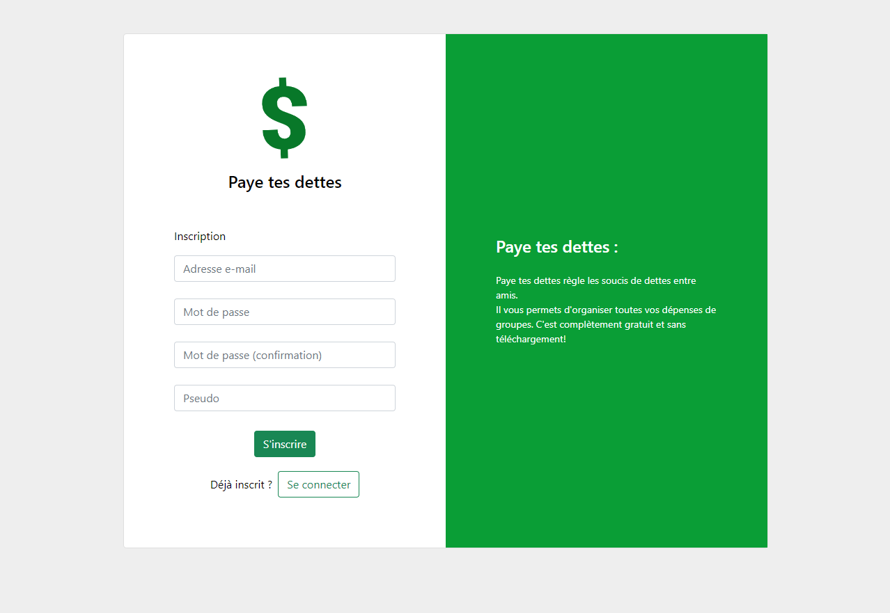   
- Email de bienvenue :   
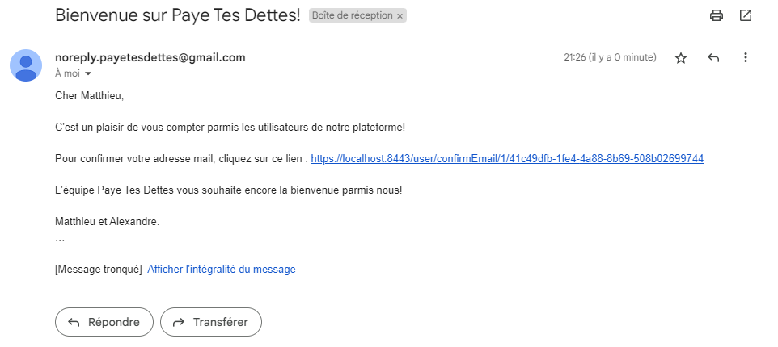   
- Connexion :   
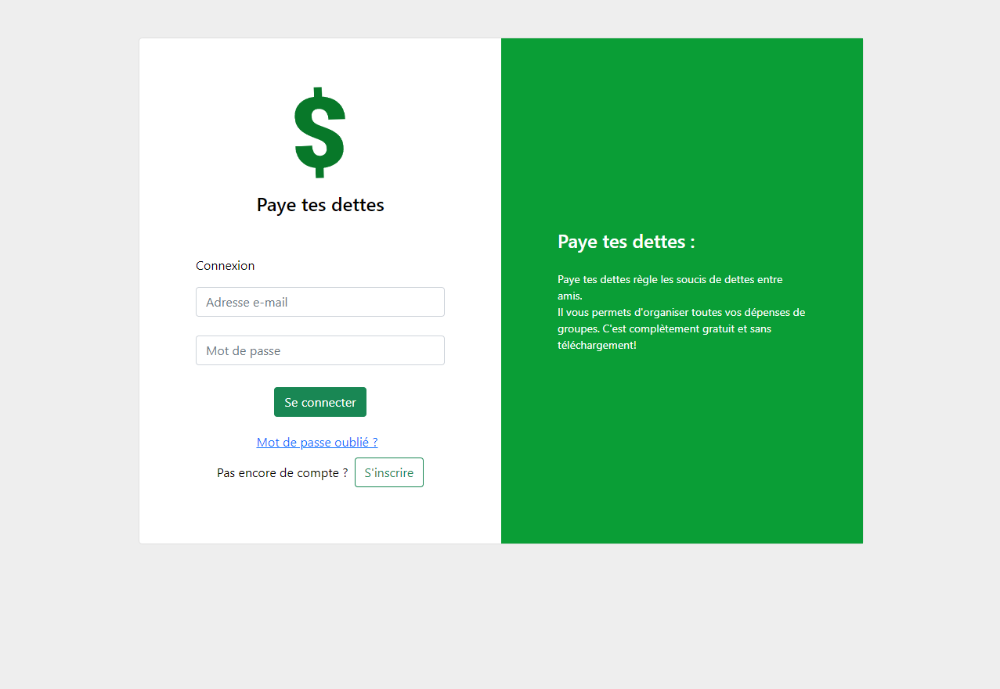   
- Index :   
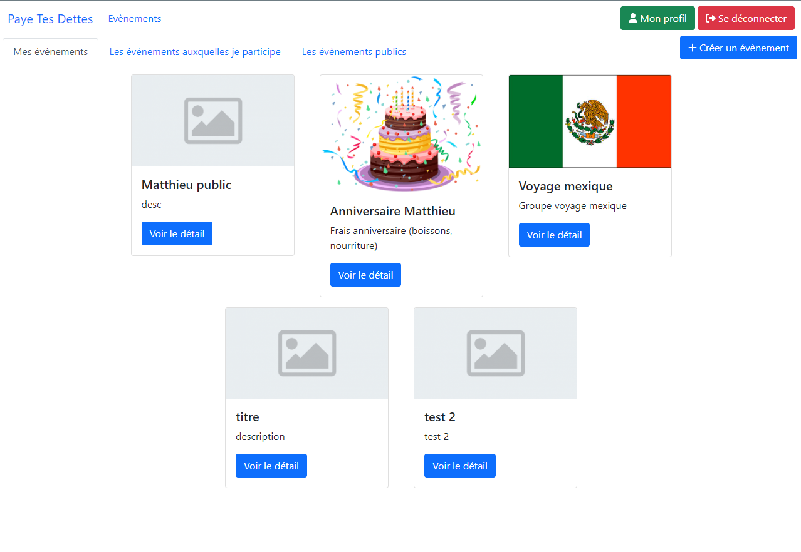   
- Nouvel évènement :   
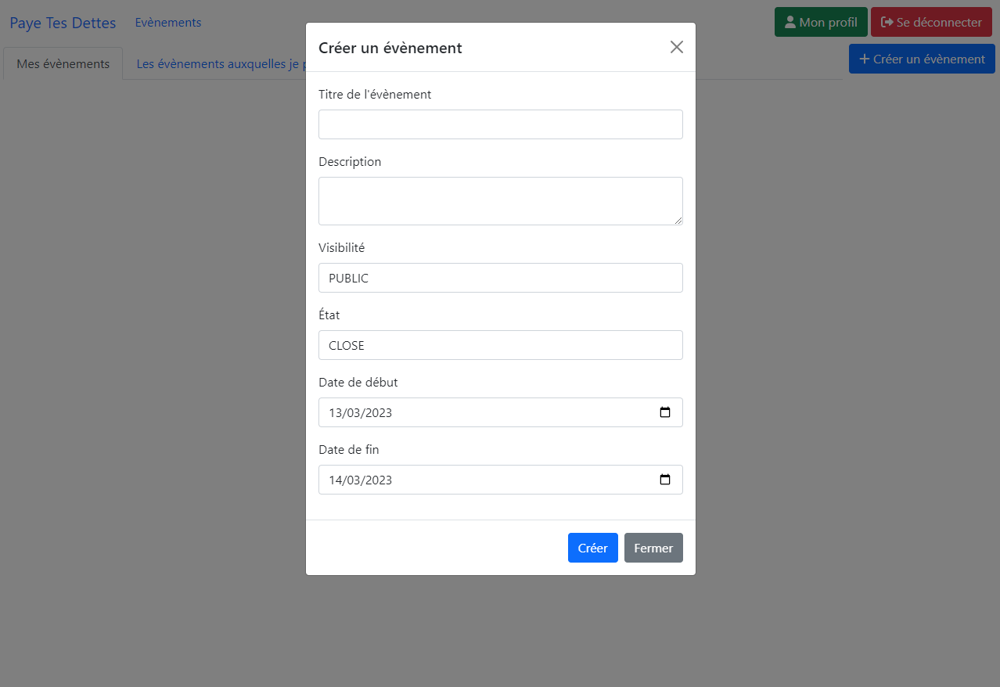   
- Détail d'un évènement :   
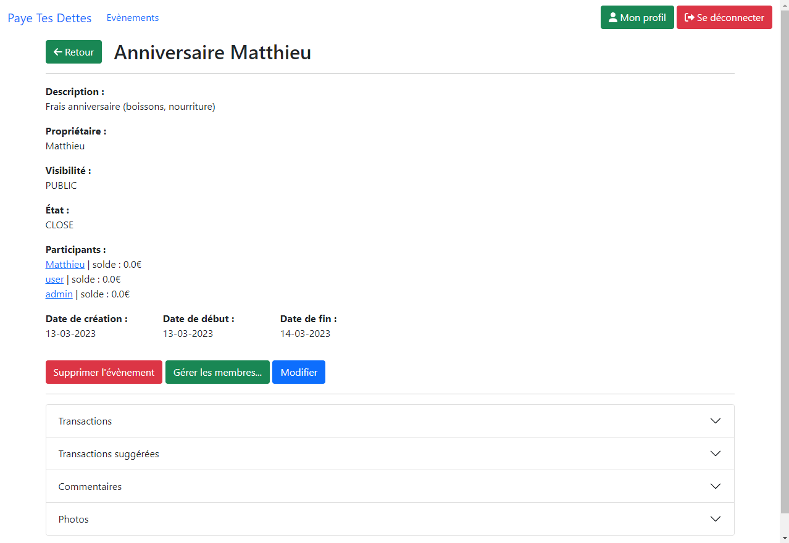   
- Recherche d'un évènement :   
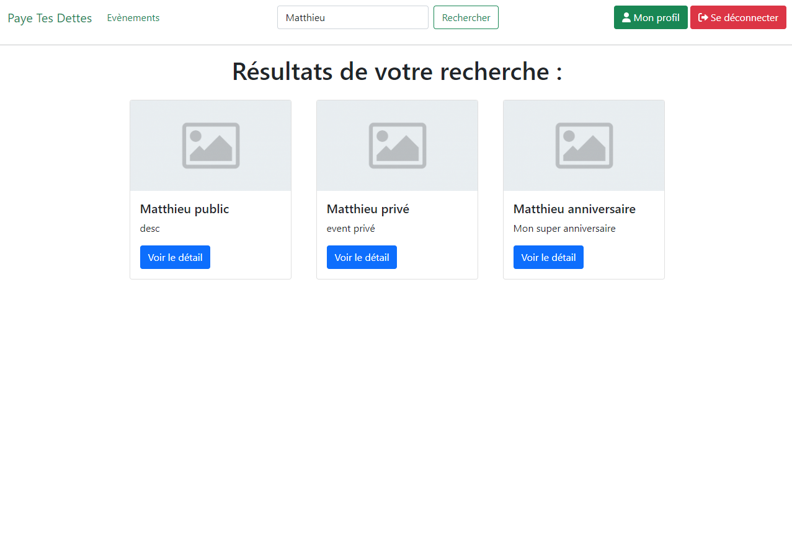   
- Gestion des membres d'un évènement :   
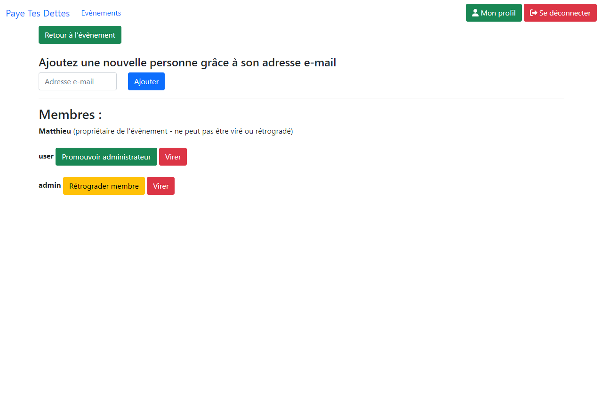   
- Commentaires au sein d'un évènement :   
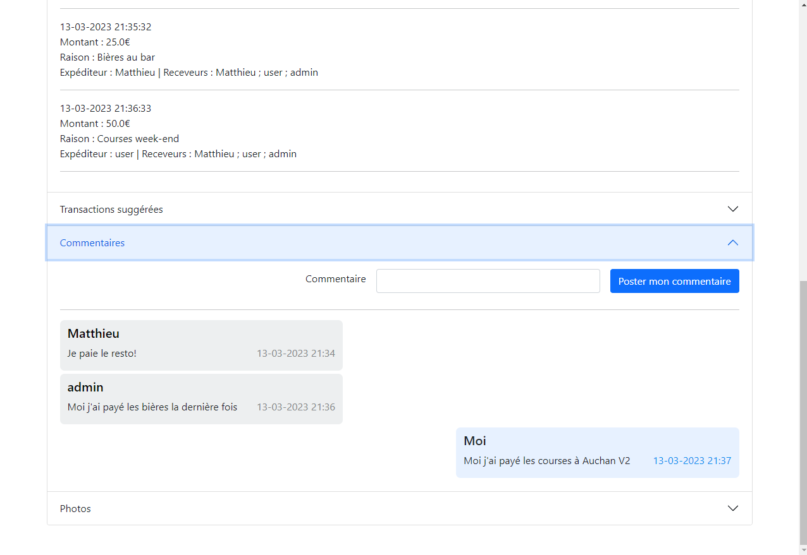   
- Nouvelle transaction :   
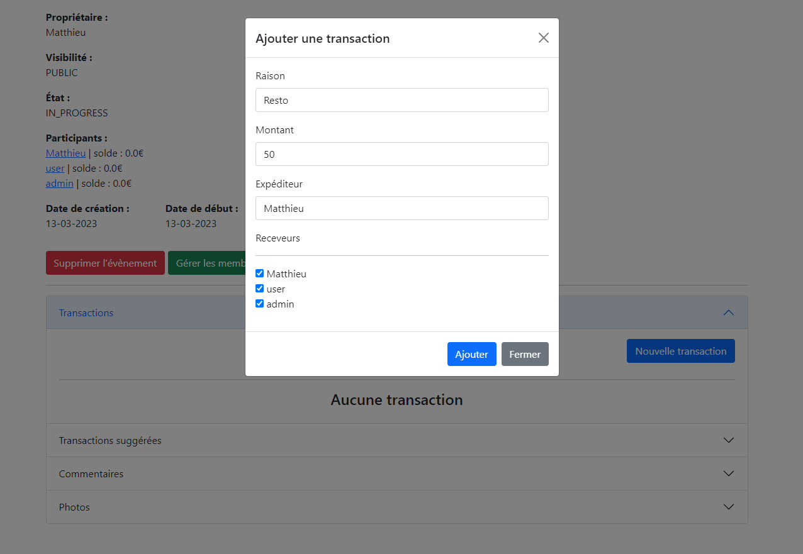   
- Liste des transactions :   
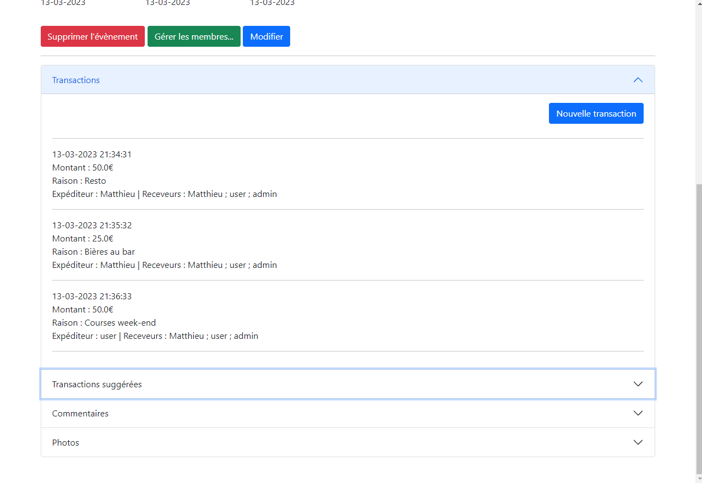   
- Transactions suggérées :   
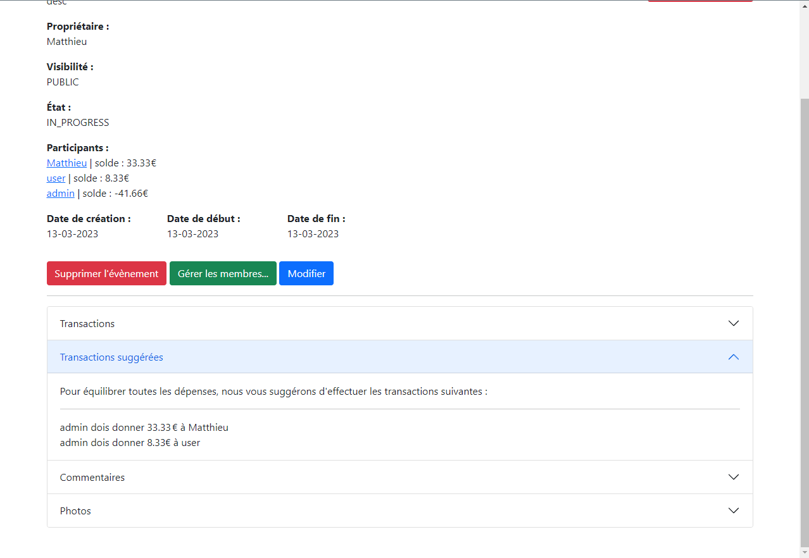   
- Mot de passe oublié - étape 1 :   
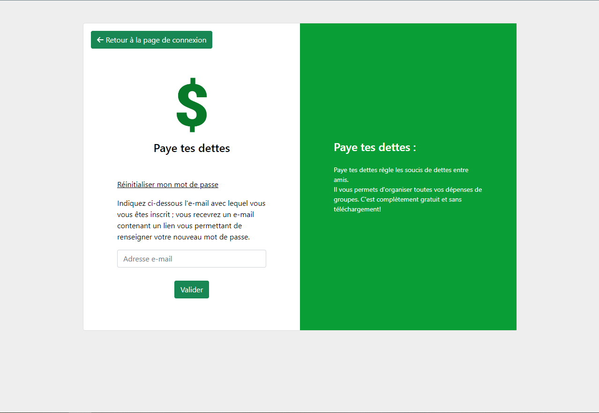   
- Mot de passe oublié - étape 2 :   
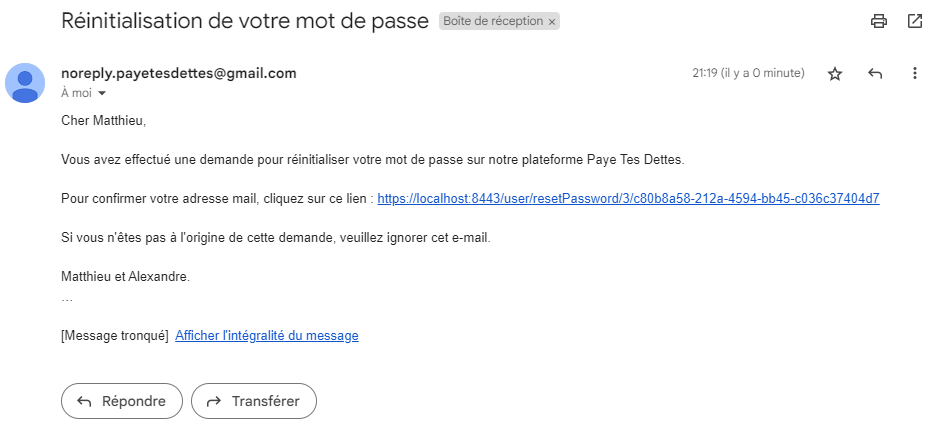   
- Mot de passe oublié - étape 3 :   
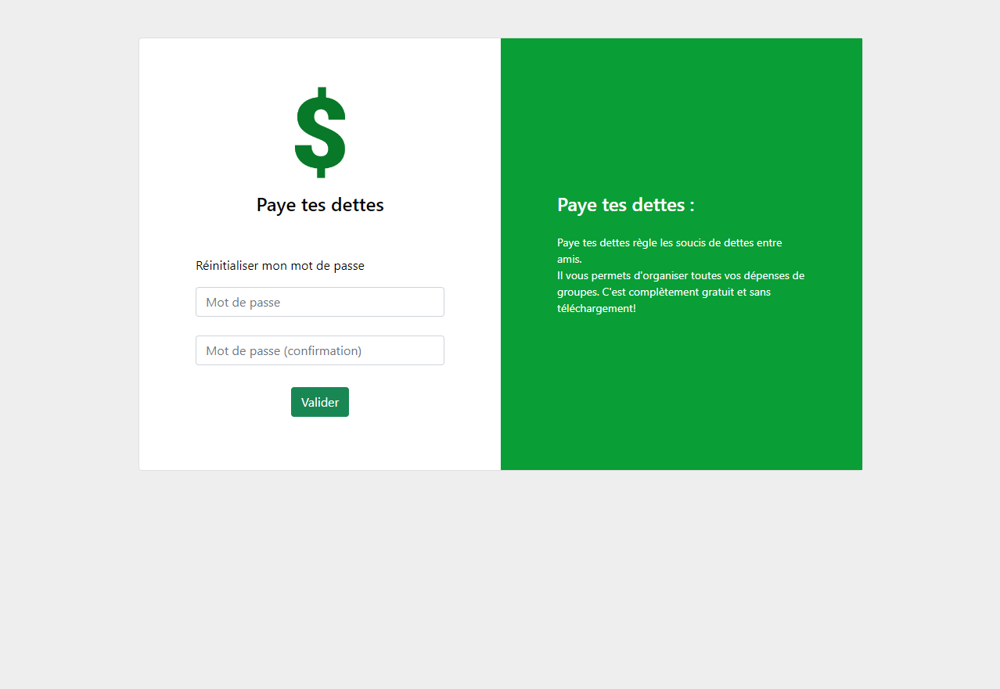   
